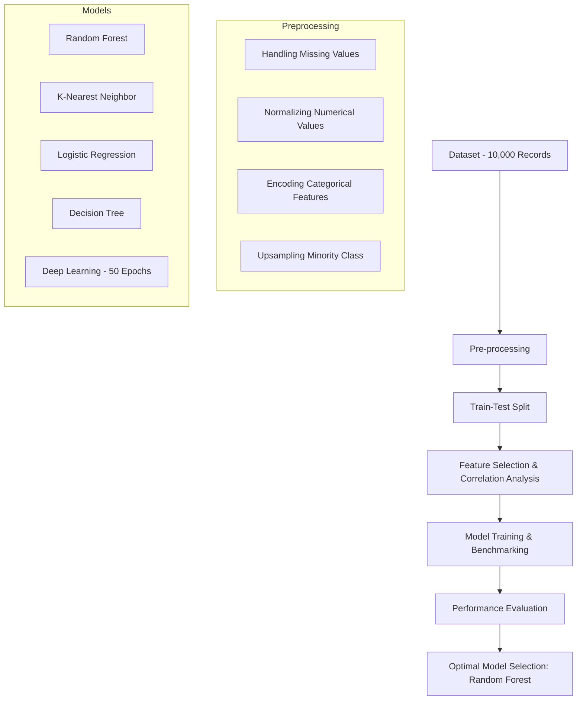

# Heart Attack Prediction for Young Adults in India

[](https://opensource.org/licenses/MIT)
[](https://www.python.org/downloads/)
[](#)

## 📌 Project Overview
This project is based on published research focused on predicting the likelihood of heart attacks among youngsters in India. Using a dataset of **10,000 health records** sourced from Kaggle, the study analyzes 26 distinct attributes across demographics, lifestyle, and medical history.

## 📖 Methodology

### Dataset Configuration
The research utilizes data from young adults in India, evaluating:
- **Demographics**: Age, Gender, Region, Urban/Rural, Socioeconomic Status (SES).
- **Lifestyle**: Smoking (Never/Occasionally/Regularly), Alcohol Consumption, Diet Type (Vegetarian/Non-Vegetarian/Vegan), Physical Activity, Screen Time, and Sleep Duration.
- **Medical History**: Family history of heart disease, Diabetes, Hypertension, BMI, Stress levels.
- **Clinical Indicators**: Blood Pressure (Systolic/Diastolic), Heart Rate, ECG results, Chest Pain type, Blood Oxygen ($SpO_2$), and Triglyceride levels.

### Data Preprocessing
To ensure model reliability and interpretability, the following steps were implemented:
1. **Handling Missing Values**: Ensuring data completeness.
2. **Normalization**: Scaling numerical variables for consistent model weightage.
3. **Label Encoding**: Converting categorical features into numerical format.
4. **Addressing Imbalance**: The minority class was **upsampled** to prevent model bias toward majority outcomes.

## 📊 Model Performance Comparison

The study benchmarked five algorithms to find the most effective predictor for cardiovascular risk:

| Model | Accuracy | Precision | Recall | F1-Score |
| :--- | :---: | :---: | :---: | :---: |
| **Random Forest** | **97%** | **95%** | **99%** | **97%** |
| Deep Learning (ANN) | 77% | 79% | 74% | 76% |
| K-Nearest Neighbor (KNN) | 75% | 67% | 97% | 79% |
| Decision Tree | 57% | 55% | 63% | 59% |
| Logistic Regression | 53% | 52% | 56% | 54% |

## 🔍 Key Findings & Feature Importance

The research yielded several critical clinical and technical insights:

### Technical Insights
- **Optimal Predictor**: Random Forest outperformed all other models, particularly in **Recall (99%)**, which is vital for medical screening to ensure high-risk cases are not missed.
- **Feature Importance**: Analysis indicates that **Systolic BP, Diastolic BP, Triglyceride levels, and Resting Heart Rate** are the most significant predictors of cardiovascular risk.

### Clinical Correlations
- **Interconnected Factors**: **91%** of individuals who had a heart attack possessed at least one of these factors: smoking, alcohol consumption, high BP, family history, or cholesterol > 200mg/dL.
- **Lifestyle Impact**: **43%** of the study population exhibited insufficient sleep (< 8 hours) and excessive screen time (> 4 hours), both of which showed strong correlations with increased heart disease risk.
- **Biometric Links**: Correlation heatmaps confirmed strong associations between Systolic/Diastolic BP, cholesterol, and triglycerides.

## ⚙️ System Flow



## 🛠️ Features Analyzed
- **Demographics**: Age, Gender, Region, SES.
- **Lifestyle**: Smoking Status, Alcohol Consumption, Diet Type, Physical Activity, Screen Time.
- **Health Metrics**: BMI, Blood Pressure (Systolic/Diastolic), Cholesterol, Triglycerides.
- **Medical History**: Family History, Diabetes, Hypertension.

## 🚀 Getting Started

### Prerequisites
- Python 3.8+
- Pandas, NumPy, Scikit-learn, TensorFlow/Keras, XGBoost

### Installation
1. Clone the repository:
   ```bash
   git clone https://github.com/your-username/heartattack-prediction.git
   ```
2. Install dependencies:
   ```bash
   pip install pandas scikit-learn tensorflow xgboost
   ```

### Running the Analysis
To evaluate all models at once:
```bash
python all.py
```
To run the optimized Random Forest model:
```bash
python RandomForestClassifier.py
```

## 📜 Citation
This project is based on a published research paper. If you use this code or dataset, please cite the original work.

---
*Developed as part of a research study on cardiovascular health in young adults.*